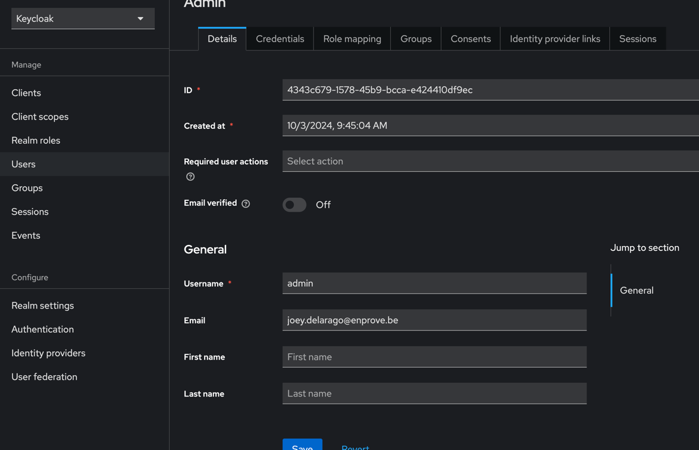

# Editing theme
This will run the editor locally, you can access it through  npm run build-keycloak-theme http://localhost:6006
```bash
npm run storybook
```

## Build
```bash
yarn install 
```

## Exporting the theme 
You will find the jar in dist_keycloak
```bash
npm run build-keycloak-theme
```

## Adding new theme pages
You can choose the new page to customize using the arrows keys
```bash
npx keycloakify add-story  
```

# Testing Email Locally
Install docker desktop https://www.docker.com/products/docker-desktop/

Run in this project folder
```bash
npx keycloakify start-keycloak
```

The logs will print out a link to log in to the front end and a link to the admin dashboard with login details.


Update the admin user email, to your email 



Update the email page with details from 1password


Set the theme to the keycloakify theme


You can send a variety of email using the credential reset


